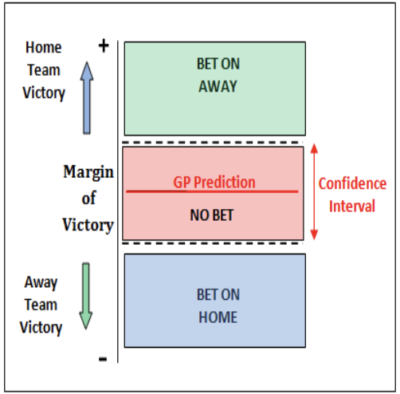
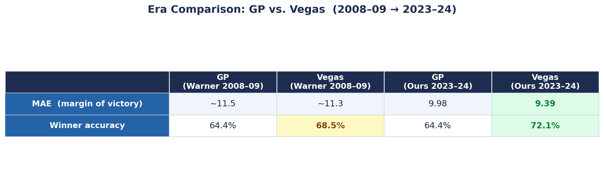
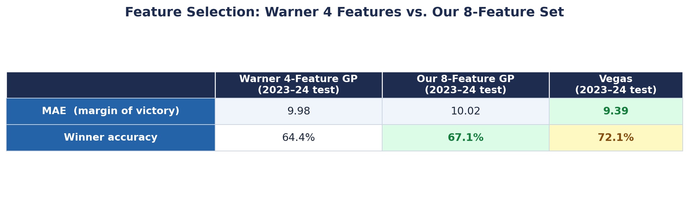
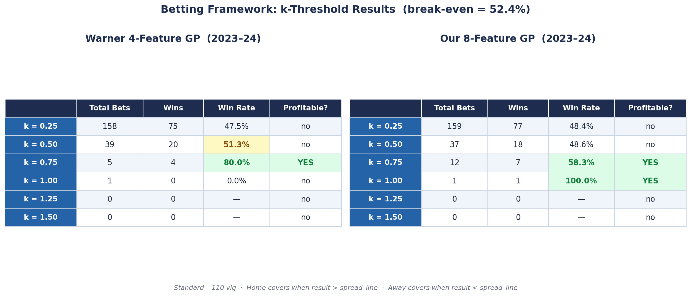
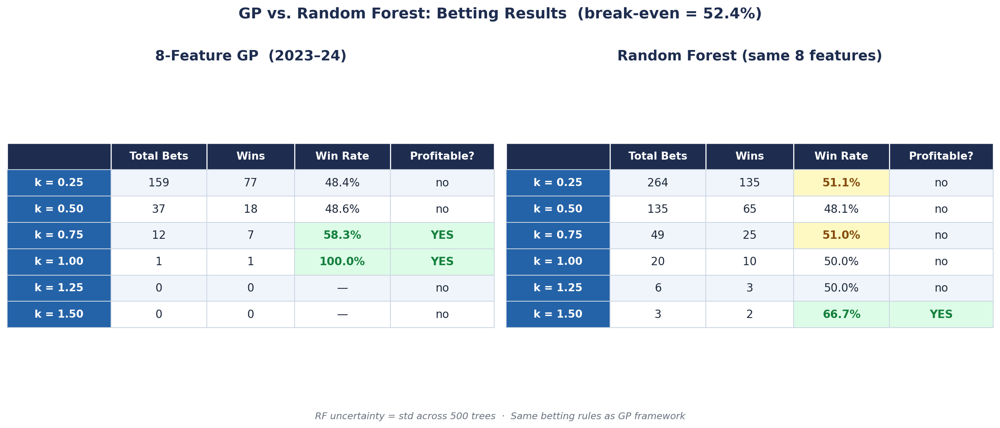

```{python}
#| echo: false
#| eval: false
# Full analysis code is in nfl_gp_starter.ipynb
```

# Background

Jim Warner in *"Predicting Margin of Victory in NFL Games: Machine Learning vs. the Las Vegas Line"* (2010) asks whether a statistical model trained purely on box-score team statistics can predict NFL game margins of victory, and whether it can compete with Vegas point spreads. Sportsbook spread lines are essentially a prediction on the favored team's margin of victory: they propose an amount of points they believe the favored team is projected to win by, and they allow bettors to place money on the favored team to win by more points than that proposition or by less points (including a loss altogether). By creating a model that outputs a prediction on the home team's margin of victory, we naturally have a metric to compare to Vegas's spread proposition in order to trigger a bet. What makes this modeling problem particularly challenging is that a win rate of greater than 50% over the Vegas line is not necessarily sufficient; since sportsbooks charge a small fee embedded into the odds of every bet attempting to create an edge, our model must pick the correct side of the Vegas line around 52.4% or greater to ensure profitability, assuming the standard vig (represented by -110 in American odds) that is widespread across sportsbooks.

Warner's paper, and our project thereafter, analyze the existence of a model capable of achieving this win rate. This question is important because, if it is true that a machine learning model trained on accessible data can consistently outperform the Las Vegas Line over 52.4% of the time, then we would have a profitable betting scheme we could use to exploit sportsbooks.

---

# Research Question and Previous Results

Using a Gaussian Process (GP) regressor on data from the 2000–2009 NFL seasons, Warner found that his model achieved roughly 64% winner accuracy compared to Vegas's 68.5%, with comparable mean absolute error on margin of victory (~11.5 vs. ~11.3 points). Warner was unable to produce a win rate over 52.4% versus the Vegas line, and concluded that a GP trained on box-score data is insufficient in achieving profitability on sportsbooks. Since it has been quite some time since the paper's release, we aim to apply Warner's methods on modern NFL data to see how the conclusions have changed. The dynamics of the NFL are far different today than they were well over a decade ago, and sportsbooks have become far more robust in recent years, so we anticipate our conclusions will differ from those of the paper in some fashion. We replicate Warner's methodology on the years 2015–2024 (a 9 year span like the paper used) to ask a new question: has Vegas gotten sharper in the 15 years since the paper was published? If the GP's accuracy has stayed flat while Vegas has improved, that would suggest the sportsbook market has become more informationally efficient over time.

---

# Data

## Source and Scope

Our analysis uses two publicly available datasets from the `nflverse` project, an open-source repository of NFL data. Game-level results and Vegas point spreads come from `nflverse`'s `games.csv`, which contains every NFL regular-season game since 1999 along with final scores, point spreads, and totals. Per-game team statistics — yards, turnovers, and points — are aggregated from the corresponding season-level play-by-play files hosted on the `nflverse-data` GitHub releases. Our analysis covers the 2015–2024 regular seasons, yielding 2,623 total games. After filtering out early-season games that lack sufficient prior-game history to compute rolling features, 1,885 matchups remain in the modeling dataset.

The `spread_line` column in `games.csv` is sourced from ESPN and represents the consensus spread at or near game time. Warner (2010) does not specify whether his spread data reflects the opening line, the closing line, or some consensus thereof, and `nflverse` does not explicitly label its line as a closing line either. This is a minor limitation worth noting: closing lines tend to be sharper than opening lines as they incorporate late-breaking information such as injury reports and sharp betting activity, so it is possible our Vegas benchmark and Warner's are not perfectly comparable on this dimension. However, all lines from open to close tend to be very similar if not the same, so our results still hold significance even if our lines and the paper's lines were snapshotted at different times.

## Features

We construct 46 features per matchup (23 per team) from the play-by-play data, mirroring and extending Warner's original feature set. Warner used 10 base statistics per team, which are points scored, points allowed, total yards, total yards allowed, rushing yards, rushing yards allowed, passing yards, passing yards allowed, turnovers taken, and turnovers lost. For each of these 10 statistics we also compute two versions: a season-to-date average, which captures a team's overall performance level for the year, and a 4-game rolling average (referred to as a streak), which captures recent form and momentum. We also compute season-to-date and 4-game rolling win percentage for each team, and the Keener eigenvalue-based computed strength rating described in Section 4.4. This yields 23 features per team and 46 total per matchup.

All features are computed using only games played prior to the current week to prevent data leakage, meaning the model only ever sees information that would have been available at kickoff. The 4-game rolling features require a team to have played at least 4 prior games in the current season, which means matchups from weeks 1–4 of each season are excluded from the dataset entirely. This is the reason our 2,623 loaded games reduce to 1,885 usable matchups. The table below summarizes how the 46 features per matchup are dispersed.

| Feature Group | Variables | Per Team |
|---|---|---|
| Season-to-date averages | Points scored/allowed, total/rush/pass yards, turnovers taken/lost | 10 |
| 4-game rolling averages | Same 10 stats as above | 10 |
| Win percentage | Season-to-date and 4-game rolling | 2 |
| Computed strength | Keener eigenvalue ranking (Section 4.4) | 1 |
| **Total** | | **23 × 2 = 46** |

## Train / Test Split

We train our Gaussian Process model on this data from the years 2015 to 2022, and we test the model on games from 2023 and 2024. This mirrors the scheme Warner employed in the paper and allows us to achieve directly comparable results while maintaining a sufficient amount of data for both training and testing purposes.

---

# Methods

## Gaussian Process Regression

*[2–3 paragraphs. What is a GP? What does it give you that linear regression does not? Keep it accessible — you can reference the Background section of the student assignment for phrasing.]*

A Gaussian Process (GP) is a nonparametric Bayesian regression model. Unlike linear regression, which produces a single predicted value for each input, a GP returns a **full predictive distribution**: a predicted margin and a calibrated uncertainty estimate (standard deviation). This is especially useful for sports prediction, where the confidence in a prediction varies — a matchup between two evenly-matched teams should carry higher uncertainty than one between a dominant and a weak team.

*[Describe the kernel intuitively: it encodes the assumption that teams with similar statistics should have similar outcomes.]*

## Kernel Choice

*[1–2 paragraphs. Describe the RBF + WhiteKernel combination. What does each term represent? What are the learned parameters (length scale, noise level) and what do they mean in context?]*

We use the same kernel as Warner: a **squared-exponential (RBF) kernel** plus a **WhiteKernel** to capture irreducible noise:

$$k(x_i, x_j) = \sigma^2 \exp\left(-\frac{\|x_i - x_j\|^2}{2\ell^2}\right) + \sigma_n^2 \delta_{ij}$$

*[Interpret $\ell$ and $\sigma_n^2$ in the context of NFL prediction. What does a large noise level imply?]*

## Computed Strength Rankings

*[1 paragraph. Describe the Keener eigenvalue ranking from Warner Section 2.2.1. Why is this more informative than a simple win-loss record?]*

Following Warner Section 2.2.1, we compute an eigenvalue-based strength rating for each team at each week of the season. The rating is the dominant eigenvector of a matrix $A$ where each entry $A_{ij}$ encodes how decisively team $i$ has outperformed team $j$ in their head-to-head history, smoothed by the function $h(x) = 0.5 + 0.5 \cdot \text{sgn}(x - 0.5) \cdot \sqrt{|2x-1|}$. This dampens blowout wins, rewarding consistent performance over margin-of-victory inflation.

## Feature Selection

With 46 available features, using all of them simultaneously is not necessarily optimal. More features increases the dimensionality of the input space, which can hurt GP performance as the kernel's notion of similarity between two matchups becomes diluted across many variables, some of which may be redundant or noisy. Warner addressed this by running a forward feature selection procedure on his training data to identify a compact, high-signal feature subset. Warner's selection process began with a base set of home and away win percentage, treating these as the two most fundamental predictors of team quality, which is a natural conclusion. From there, he evaluated every remaining candidate feature by adding it to the base set one at a time and measuring the resulting model's cross-validated mean absolute error (MAE). He retained the top candidates from this screening step and then ran a greedy forward search: iteratively adding whichever feature produced the largest reduction in cross-validated MAE, stopping when no remaining feature improved performance. Warner's search converged on a final set of four features: home win percentage, away win percentage, away computed strength, and away passing yards per game (4-game streak). Notably, three of the four are away-team statistics.

We run the GP using Warner's exact four features on our 2015–2024 data as our primary replication, since this allows us to compare our results directly to the numbers reported in the paper. However, we also re-run the feature selection procedure on our own training data to find the optimal feature subset for the modern era. This serves two purposes: it tells us whether Warner's 4-feature set still represents a good choice on modern data, and it allows our modern GP to make predictions based on features calibrated for the modern game. Our selection process mirrors Warner's exactly. We start from the same base set of home and away win percentage, screen all 44 remaining candidates using leave-one-season-out cross-validation on the 2015–2022 training seasons, take the top 20 by CV MAE as the search pool, and run a greedy forward search over those 20, stopping when no additional feature reduces cross-validated error.

Our search converged on eight features:

- Home win percentage, away win percentage (base set)
- Away points scored (season-to-date average)
- Home computed strength
- Away total yards (season-to-date average and 4-game streak)
- Home points allowed (4-game streak)
- Away turnovers lost (season-to-date average)

## Betting Framework

One of the key advantages of a Gaussian Process over a simpler regression model is that every prediction comes with a calibrated uncertainty estimate — a standard deviation $\sigma$ reflecting how confident the model is about that particular matchup. Warner's betting framework exploits this directly. Rather than betting on every game, Warner proposes placing a bet only when the Vegas spread line falls outside the GP's 95% confidence interval around its predicted margin. The intuition is that a disagreement between the model and Vegas that falls within the model's own uncertainty is not worth acting on, while a disagreement large enough to exceed the 95% interval represents a more genuine signal that the line may be mispriced.

Concretely, let $\hat{y}$ be the GP's predicted home margin, $\sigma$ be its predicted standard deviation, and $s$ be the Vegas spread line. Warner bets on the home team to cover when $\hat{y} - 1.96\sigma > s$, and on the away team when $\hat{y} + 1.96\sigma < s$. When the spread line falls inside the 95% interval, no bet is placed. This is illustrated in the figure below.

{width=55%}

As an extension to Warner's framework, we generalize the fixed 95% threshold to a tunable parameter $k$, evaluating the strategy across $k$ values from 0.25 to 1.5. A lower $k$ corresponds to a narrower confidence interval and triggers more bets, including cases where the model's confidence is modest; a higher $k$ filters down to only the most emphatic disagreements between the model and Vegas but leaves very few bets in the sample. This allows us to examine the tradeoff between bet volume and selectivity, and to assess whether any threshold produces a profitable win rate. As a reminder, at standard −110 vig, the break-even win rate required for profitability is 52.4%. We apply this framework to both the Warner 4-feature GP and our 8-feature GP and report the results in Section 5.3.

## Random Forest Comparison

A natural question when evaluating the GP is whether its performance is a property of the model class or simply a reflection of the underlying data. If the features we constructed are genuinely not predictive enough to beat Vegas, then any reasonable regression model should struggle similarly. To investigate this, we also fit a Random Forest regressor on the same 8 selected features and the same 2015–2022 training data.

Random Forests are an ensemble method that averages predictions across a large number of decision trees, each trained on a bootstrapped sample of the data. Unlike a GP, a Random Forest does not assume any particular functional form for the relationship between features and outcomes, making it a flexible alternative that serves as a useful point of comparison. We trained 500 trees with a minimum leaf size of 5 to prevent overfitting, and we estimated prediction uncertainty as the standard deviation of predictions across the 500 trees — a natural analogue to the GP's posterior standard deviation. This allows us to apply Warner's betting framework to the Random Forest using the exact same rules, and compare the betting results of the two models directly.

---

# Results

## Era Comparison: Has Vegas Gotten Sharper?

We begin by evaluating the GP using Warner's exact four features from the paper, which are home win percentage, away win percentage, away computed strength, and away passing yards per game (4-game streak), on our 2015–2024 data. This allows us to make a direct apples-to-apples comparison with the numbers reported in the paper.

On the 2023–2024 test set, our GP achieved a mean absolute error of 9.98 points and a winner accuracy of 64.4%. The MAE is a notable improvement over Warner's reported ~11.5 points, but this does not necessarily mean the model has gotten better at predicting NFL outcomes. A more likely explanation is that the league itself has become more competitive over time, with games being decided by smaller margins on average, making the raw prediction error smaller regardless of model quality. The winner's accuracy tells a cleaner story: at 64.4%, it is identical to what Warner reported in 2010, suggesting the model's ability to pick the correct side has not meaningfully changed in 15 years.

Vegas, however, has improved substantially. The spread line achieved a winner accuracy of 72.1% on our test set, up from ~68.5% in Warner's data. The gap between the GP and Vegas has widened from roughly 4 percentage points to nearly 8. This widening suggests that the GP has stood still, the sportsbook market has become significantly more informationally efficient. The era comparison is summarized in the figure below.

{width=95%}

## Feature Selection Results

It is not fair to conclude GP performance has not changed by using the exact same feature set as the paper, since certain features are plausibly more or less predictive in the modern football era. To address this, we created a new GP trained on the 8-feature set discussed above that is supposedly better calibrated to the modern game. Running the GP on this updated feature set improved winner accuracy from 64.4% to 67.1% on the 2023–2024 test set, a meaningful gain that suggests our selected features do carry more signal for the current era. However, MAE was essentially unchanged at 10.02 points versus 9.98 with Warner's features, indicating that the additional features help the model identify the correct side of a matchup more often, but do not help it predict the margin of victory more precisely. Even with the improved feature set, the GP still falls well short of Vegas's 72.1% winner accuracy, reinforcing that the gap is not primarily a feature selection problem. The results are summarized in the figure below.

{width=95%}

## Betting Framework

We sweep $k$ from 0.25 to 1.5 to evaluate whether any confidence threshold produces a win rate above the 52.4% break-even win rate. Unsurprisingly, neither the Warner 4-feature GP nor our 8-feature GP achieves a profitable win rate at any threshold with a meaningful number of bets (more than just a few). What is surprising is that no bets were placed for $k > 1.25$, while Warner's GP placed several bets with $k = 1.96$. Looking at the 4-feature GP for example, the median posterior standard deviation is approximately 13.24 points, so a bet at $k = 1.96$ would only be triggered when the spread line differs from the GP's prediction by more than 26 points, which is an extraordinary disagreement that almost never occurs in practice. So, why did this disagreement occur so often back in 2008-9? Precisely because Vegas was less accurate at the time; a less efficient market produced more lines that appeared exploitable relative to the model's uncertainty. Today, Vegas prices games tightly enough that the GP almost never sees a spread it disagrees with by that margin, leaving very little room for the betting framework to operate. The betting results for both models are shown in the figure below.

{width=95%}

## Random Forest Betting Results

Random Forests are widely regarded as a strong baseline for tabular data, so applying the same betting framework to the RF provides a meaningful check on whether the GP's failure to find a profitable edge is a model-specific limitation or a property of the data itself. One notable difference between the two models is that the RF places more bets at every $k$ level. This is because the RF's uncertainty estimate — the standard deviation across 500 trees — tends to be smaller and more tightly calibrated than the GP's posterior $\sigma$, so the spread line more frequently falls outside the RF's confidence interval and triggers a bet. Despite placing more bets, the RF does not achieve a consistent profitable win rate at any threshold either. The fact that two models with very different architectures, assumptions, and uncertainty estimates both fail to find a reliable edge against the spread reinforces the conclusion that the problem lies with the data rather than the model: box-score statistics simply do not contain enough information to systematically exploit modern Vegas lines.

{width=95%}

---

# Discussion

## Key Takeaways

*[Bulleted or paragraph form. Cover the three main findings:]*

1. **Vegas has gotten substantially sharper.** Winner accuracy jumped from ~68.5% (2008–09) to 72.1% (2023–24). The GP stayed at 64.4%. The gap has widened.

2. **Both allowing the model to chose new features and using a random forest still cannot does not come close to vegas in terms of accuracy** Our 8-feature model picks winners at 67.1% vs. Warner's 4-feature 64.4%, but MAE is essentially unchanged (~10 points). More features help identify the right side but not the right magnitude. And the RF performed similarly.

3. **No exploitable betting edge.** At every k threshold with a reasonable sample (k ≤ 0.5), win rates fall below the 52.4% break-even. The model rarely disagrees with Vegas by more than one standard deviation on confident games.

## Limitations

*[3–4 bullet points. Consider: no injury data, no weather, no line movement, no roster changes, no divisional/playoff context, feature selection is greedy and not necessarily optimal, Vegas lines incorporate information the model cannot observe.]*

---

# Conclusion

*[1 short paragraph. Restate the central finding in plain language: box-score statistics alone are no longer sufficient to compete with modern Vegas lines.]*

mention how this was the conclusion in Warner, but mention how it has become even more impossible to leverage box-score stats to beat vegas.

---

# References

Warner, G. (2010). *Winning isn't Everything: A Contextual Analysis of Results in the NFL Using Gaussian Processes.* Proceedings of the MIT Sloan Sports Analytics Conference.

Anthropic. (2025). *Claude Code* (Version claude-sonnet-4-6) [Large language model]. Used to assist with document formatting and proofreading. https://claude.ai/code

---

# Appendix: Code

The complete analysis code is available in `nfl_gp_starter.ipynb`. Key sections are reproduced below for reference.

## Data Loading and Feature Construction

```{python}
import pandas as pd
import numpy as np

TRAIN_SEASONS = list(range(2015, 2023))
TEST_SEASONS  = list(range(2023, 2025))
ALL_SEASONS   = TRAIN_SEASONS + TEST_SEASONS

BASE_STATS = [
    "points_scored", "points_allowed",
    "total_yards", "total_yards_allowed",
    "rush_yards", "rush_yards_allowed",
    "pass_yards", "pass_yards_allowed",
    "turnovers_taken", "turnovers_lost",
]

games = pd.read_csv(
    "https://raw.githubusercontent.com/nflverse/nfldata/master/data/games.csv",
    low_memory=False
)
games = games[
    (games["game_type"] == "REG") &
    (games["result"].notna()) &
    (games["season"].isin(ALL_SEASONS))
].copy()
```

## Computed Strength (Keener Ranking)

```{python}
def h_func(x):
    return 0.5 + 0.5 * np.sign(x - 0.5) * np.sqrt(np.abs(2 * x - 1))

def compute_strength(games_df):
    teams = sorted(set(games_df["home_team"]) | set(games_df["away_team"]))
    n = len(teams)
    idx = {t: i for i, t in enumerate(teams)}
    S = np.zeros((n, n))
    for _, row in games_df.iterrows():
        i, j = idx[row["home_team"]], idx[row["away_team"]]
        S[i][j] += row["home_score"]
        S[j][i] += row["away_score"]
    A = np.zeros((n, n))
    for i in range(n):
        for j in range(n):
            total = S[i][j] + S[j][i]
            if total > 0:
                A[i][j] = h_func((S[i][j] + 1) / (total + 2))
    r = np.ones(n) / n
    for _ in range(200):
        r_new = A @ r
        norm = r_new.sum()
        if norm == 0: break
        r_new /= norm
        if np.allclose(r, r_new, atol=1e-10): break
        r = r_new
    return dict(zip(teams, r))
```

## GP Model

```{python}
from sklearn.gaussian_process import GaussianProcessRegressor
from sklearn.gaussian_process.kernels import RBF, WhiteKernel
from sklearn.preprocessing import StandardScaler
from sklearn.metrics import mean_absolute_error

GP_FEATURES = ["H_win_pct", "A_win_pct", "A_computed_strength", "A_pass_yards_streak"]

scaler  = StandardScaler()
X_train = scaler.fit_transform(train_gp[GP_FEATURES])
X_test  = scaler.transform(test_gp[GP_FEATURES])

kernel = RBF() + WhiteKernel()
gp = GaussianProcessRegressor(kernel=kernel, n_restarts_optimizer=5, normalize_y=True)
gp.fit(X_train, train_gp["result"].values)

y_pred, y_std = gp.predict(X_test, return_std=True)
```

## Betting Framework

```{python}
def evaluate_betting(test_df, k):
    home_bets = test_df[test_df["gp_pred"] - k * test_df["gp_std"] > test_df["spread_line"]]
    away_bets = test_df[test_df["gp_pred"] + k * test_df["gp_std"] < test_df["spread_line"]]
    home_wins = (home_bets["result"] > home_bets["spread_line"]).sum()
    away_wins = (away_bets["result"] < away_bets["spread_line"]).sum()
    total_bets = len(home_bets) + len(away_bets)
    total_wins = int(home_wins + away_wins)
    win_rate   = total_wins / total_bets if total_bets > 0 else float("nan")
    return {"k": k, "bets": total_bets, "wins": total_wins, "win_rate": win_rate}
```
